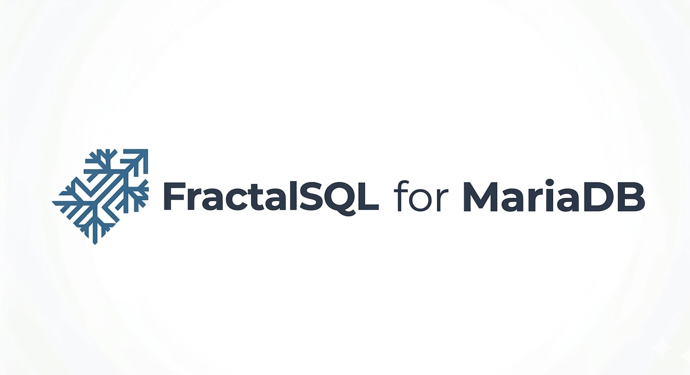

<p align="center">
  
</p>

# mariadb-fractalsql by FractalSQLabs

**Stochastic Fractal Search as a MariaDB UDF.** One function, four
arguments, a JSON document back.

mariadb-fractalsql ships a LuaJIT-backed metaheuristic optimizer that
runs inside the MariaDB server process. You hand it a corpus of
vectors, a query, how many matches you want, and a tuning blob — it
returns the continuous best point plus the top-k stored vectors as a
single JSON string that MariaDB's own `JSON_EXTRACT()` can slice.

## Zero-Dependency Posture

- **Static LuaJIT** — `libluajit-5.1.a` is built with `-fPIC` +
  `BUILDMODE=static` from Mike Pall's GitHub mirror and folded into
  `fractalsql.so`. No `libluajit-5.1.so` dependency, no `luajit`
  RPM requirement.
- **Static C/C++ runtime** — `-static-libgcc -static-libstdc++` +
  `-D_GLIBCXX_USE_CXX11_ABI=0`; the shipped `.so` depends on glibc
  only (libc, libm, libdl, libpthread, ld-linux — the kernel
  shortlist).
- **Static MSVC CRT on Windows** — `/MT /GL /LTCG`; the shipped
  `.dll` has no VC++ Redistributable requirement.
- **One .so per Linux arch** — the MariaDB UDF ABI (`UDF_INIT`,
  `UDF_ARGS`, `MYSQL_ERRMSG_SIZE`, the init/main/deinit signatures)
  has been stable across 10.6 / 10.11 / 11.4 LTS and 12.2 rolling,
  so the same binary works on every supported major. The `.deb` /
  `.rpm` depends on `mariadb-server` generically.
- **Minimum glibc 2.38** — aligned with Ubuntu 24.04 LTS / Debian 13
  and any RHEL-family distro shipping glibc 2.34+.

## Compatibility matrix

|                    | Linux amd64 | Linux arm64 | Windows x86 | Windows x64 | Windows arm64 |
| ------------------ | :---------: | :---------: | :---------: | :---------: | :-----------: |
| MariaDB 10.6       |     ✓       |      ✓      |     —       |     ✓       |       —       |
| MariaDB 10.11      |     ✓       |      ✓      |     —       |     ✓       |       —       |
| MariaDB 11.4 LTS   |     ✓       |      ✓      |     —       |     ✓       |       —       |
| MariaDB 12.2 rolling |   ✓       |      ✓      |     —       |     ✓       |       —       |

**Linux.** One `fractalsql.so` per arch covers every listed MariaDB
major — no per-major fan-in.
**Windows.** MariaDB Foundation does not publish 32-bit Windows
server binaries on the current LTS majors, and has not yet shipped
Windows ARM64 in an extractable `.zip` form — both cells are
deferred until upstream host binaries exist. Windows x64 ships one
MSI per MariaDB major because the install path is major-specific
(`C:\Program Files\MariaDB <VER>\lib\plugin\`).

**11.4 vs 12.2.** 11.4 is the current LTS line (5-year support);
12.2 is a rolling / short-term-support release. Both expose the
same UDF ABI and both ship Windows x64 binaries upstream, so the
Community Edition covers each identically.

MariaDB 11.7+ introduced a native VECTOR type (distinct from MySQL
9.0's encoding). The UDF signature here accepts only CSV /
bracketed-JSON inputs — VECTOR values round-tripped through
`VEC_ToText()` work transparently. A dedicated binary-decode path
can be enabled behind a compile flag in a later iteration.

---

## The UDFs

```sql
fractal_search(
    vector_csv   TEXT,   -- corpus of stored vectors (or empty string)
    query_csv    TEXT,   -- single query vector
    k            INT,    -- top-k to return (capped at len(corpus))
    params       TEXT    -- JSON object of SFS tuning knobs
) RETURNS STRING         -- JSON document

fractalsql_edition()  RETURNS STRING     -- 'Community'
fractalsql_version()  RETURNS STRING     -- '1.0.0'
```

### Input encoding

Vectors travel as either a bracketed JSON-ish form or a flat CSV:

| Form | Example |
| --- | --- |
| Nested JSON array | `'[[1,0,0],[0,1,0],[0,0,1]]'` |
| Semicolon rows    | `'1,0,0;0,1,0;0,0,1'` |
| Single vector     | `'0.6,0.6,0'` or `'[0.6,0.6,0]'` |
| Empty corpus      | `''` (skips top-k, returns only `best_point`) |

### Params (JSON, all optional)

| Key | Default | Range | Notes |
| --- | --- | --- | --- |
| `iterations`       | 30  | 1..100 000 | SFS generations |
| `population_size`  | 50  | 2..10 000  | candidate points held per generation |
| `diffusion_factor` | 2   | 1..100     | walks-per-particle (MDN) |
| `walk`             | 0.5 |            | 0 = pure self-diffusion, 0.5 = canonical SFS |
| `debug`            | false |          | includes per-generation trace in output |

### Output document

```json
{
  "dim": 3,
  "n_corpus": 4,
  "best_point": [0.601, 0.598, 0.003],
  "best_fit": 0.00014,
  "top_k": [
    {"idx": 3, "dist": 0.021},
    {"idx": 0, "dist": 0.183},
    {"idx": 1, "dist": 0.201}
  ],
  "trace": { ... }
}
```

Slice it with MariaDB's JSON functions — no client-side parsing
needed:

```sql
SELECT
  JSON_EXTRACT(r, '$.best_point')     AS best_point,
  JSON_EXTRACT(r, '$.top_k[0].idx')   AS top_hit,
  JSON_EXTRACT(r, '$.top_k[0].dist')  AS top_dist
FROM (
  SELECT fractal_search(
      '[[1,0,0],[0,1,0],[0,0,1],[0.5,0.5,0]]',
      '0.6,0.6,0',
      3,
      '{"iterations":30,"population_size":50,"walk":0.5}'
  ) AS r
) t;
```

---

## Installation

### Linux — from release packages

Grab the `.deb` or `.rpm` matching your CPU arch from
[GitHub Releases](https://github.com/FractalSQLabs/mariadb-fractalsql/releases).
One binary covers MariaDB 10.6 / 10.11 / 11.4 LTS:

```bash
# amd64 / x86_64
sudo apt install ./mariadb-fractalsql-amd64.deb
# or
sudo rpm -i mariadb-fractalsql-amd64.rpm

# arm64 / aarch64 (AWS Graviton, Apple Silicon, Ampere Altra, …)
sudo apt install ./mariadb-fractalsql-arm64.deb
sudo rpm -i mariadb-fractalsql-arm64.rpm
```

The package drops `fractalsql.so` into `/usr/lib/mysql/plugin/` and
the registration script + LICENSE files into
`/usr/share/mariadb-fractalsql/` / `/usr/share/doc/mariadb-fractalsql/`.
Activate once:

```sql
SOURCE /usr/share/mariadb-fractalsql/install_udf.sql;
-- or from the shell:
-- mysql -u root -p < /usr/share/mariadb-fractalsql/install_udf.sql
```

Verify:

```sql
SELECT fractalsql_edition(), fractalsql_version();
SELECT name, dl FROM mysql.func;
```

### Windows — MSI install

Download the MSI matching your MariaDB major from
[GitHub Releases](https://github.com/FractalSQLabs/mariadb-fractalsql/releases):

```
FractalSQL-MariaDB-10.6-1.0.0-x64.msi
FractalSQL-MariaDB-10.11-1.0.0-x64.msi
FractalSQL-MariaDB-11.4-1.0.0-x64.msi
```

Interactive install (standard Windows double-click flow):

```powershell
msiexec /i FractalSQL-MariaDB-11.4-1.0.0-x64.msi
```

Silent install (scripting / MDM):

```powershell
msiexec /i FractalSQL-MariaDB-11.4-1.0.0-x64.msi /qn
```

Targeting a non-default MariaDB install root (e.g.
`D:\MariaDB 11.4`):

```powershell
msiexec /i FractalSQL-MariaDB-11.4-1.0.0-x64.msi /qn ^
    MARIADBROOT="D:\MariaDB 11.4"
```

The MSI drops `fractalsql.dll` into
`C:\Program Files\MariaDB <VER>\lib\plugin\` and the install SQL
plus LICENSE files into
`C:\Program Files\MariaDB <VER>\share\doc\mariadb-fractalsql\`.
Activate once from the MariaDB client:

```powershell
mysql -u root -p < "C:\Program Files\MariaDB 11.4\share\doc\mariadb-fractalsql\install_udf.sql"
```

### Building from source — Linux

The canonical build is Docker-driven and emits a single per-arch
`.so`:

```bash
./build.sh amd64   # -> dist/amd64/fractalsql.so
./build.sh arm64   # -> dist/arm64/fractalsql.so
```

The Dockerfile (`docker/Dockerfile`) builds a PIC-enabled static
LuaJIT from the GitHub mirror, compiles `fractalsql.so` against
`libmariadb-dev`, and runs `docker/assert_so.sh` to verify the
zero-dependency posture (ldd shortlist, no `__cxx11::basic_string`
leaks, size ceiling, UDF entry points in `.dynsym`). Cross-arch
builds use buildx + QEMU; CI runs both arches on every tag.

For quick local iteration against whatever libmariadb-dev is on
your path (does NOT produce a shipping artifact — uses dynamic
LuaJIT linkage):

```bash
sudo apt install -y build-essential libmariadb-dev libluajit-5.1-dev pkg-config
make
sudo make install
mysql -u root -p < sql/install_udf.sql
```

### Building from source — Windows

Requires a Developer Command Prompt for Visual Studio, a MariaDB
binaries `.zip` unpacked (for `include\mysql\*.h`), and the WiX
Toolset if you want to rebuild the MSI:

```cmd
:: Build static LuaJIT
git clone --depth 1 --branch v2.1 https://github.com/LuaJIT/LuaJIT.git deps\LuaJIT
cd deps\LuaJIT\src && call msvcbuild.bat static && cd ..\..\..

:: Build fractalsql.dll
set LUAJIT_DIR=%CD%\deps\LuaJIT\src
set MARIADB_DIR=C:\path\to\unpacked\mariadb-11.4.4-winx64
set MARIADB_MAJOR=11.4
call scripts\windows\build.bat

:: Build the MSI
set MSI_ARCH=x64
call scripts\windows\build-msi.bat
```

---

## Architectural Performance

The core optimizer is distributed as **pre-compiled LuaJIT bytecode**
embedded in the shared library. No Lua source ships with the plugin.

### No script parsing at runtime

A conventional LuaJIT embedding loads source, invokes the parser,
and generates bytecode before the first opcode executes.
mariadb-fractalsql skips all of this: the bytecode is compiled once
at release time and embedded in `fractalsql.so` as a C byte array.
Loading the optimizer on a UDF call is a `luaL_loadbuffer` over an
in-memory buffer — no tokenizer, no parser, no AST walk.

### FFI hot loops

Every per-generation computation runs in pre-allocated `double[]`
FFI cdata buffers. The inner loops — fitness evaluation, diffusion
walks, bound checking — JIT-compile to tight machine code comparable
to hand-written C. The population and all scratch buffers are
allocated once per SFS run and reused across generations.

---

## Benchmarking

A reproducible harness lives in `benchmark/`:

```bash
./build.sh amd64        # builds fractalsql.so first

MARIADB_IMAGE=mariadb:10.6  \
  docker compose -f benchmark/docker-compose.test.yml up --abort-on-container-exit

MARIADB_IMAGE=mariadb:10.11 \
  docker compose -f benchmark/docker-compose.test.yml up --abort-on-container-exit

MARIADB_IMAGE=mariadb:11.4  \
  docker compose -f benchmark/docker-compose.test.yml up --abort-on-container-exit
```

The compose file pins each container to a single dedicated CPU core
(MariaDB on core 0, Node tester on core 1) so latency numbers stay
comparable across machines with different core counts. Tunable via
env vars — see `benchmark/docker-compose.test.yml`.

The tester (Node.js 24, `benchmark/tester/run.js`) generates a random
corpus + query on each iteration, issues the UDF call, and reports
mean / p50 / p95 / p99 latency.

---

## Architecture notes

**One Lua state per UDF invocation.** MariaDB is multi-threaded with
no stable thread affinity across calls. The plugin constructs a fresh
`lua_State` in the `*_init` stage, stashes the pointer in
`initid->ptr`, and tears it down in `*_deinit`. Complete isolation
between connections *and* between calls on the same connection.

**Memory.** All FFI buffers allocated inside the optimizer are GC'd
when the Lua function returns. The UDF context's result buffer is
`realloc`'d on demand and freed in `*_deinit`.

**MariaDB 11 note.** Plugin-loader changes in MariaDB 11.x affect
storage engines and server plugins. UDFs registered via
`CREATE FUNCTION ... SONAME` take a different, unchanged code path —
this UDF is unaffected. Result-memory lifetime contracts are also
unchanged.

**Determinism.** LuaJIT's `math.random` is xoshiro256\*\*. Because each
call builds a fresh Lua state, results are reproducible across calls
when you pin `population_size` and seed `math.randomseed` in a custom
build.

---

## Third-Party Components

mariadb-fractalsql embeds two third-party components. Full notices
live in [LICENSE-THIRD-PARTY](LICENSE-THIRD-PARTY) at the repo root
(and inside every installed package under
`/usr/share/doc/mariadb-fractalsql/` on Linux,
`\share\doc\mariadb-fractalsql\` on Windows).

- **SFS Core Math** — Stochastic Fractal Search algorithm, from
  Hamid Salimi (2014). BSD-3-Clause.
- **LuaJIT** — Just-In-Time compiler and execution engine, (C)
  2005-2023 Mike Pall. MIT.

## License

MIT. See [LICENSE](LICENSE).

---

[github.com/FractalSQLabs](https://github.com/FractalSQLabs) · Issues and
PRs welcome.
